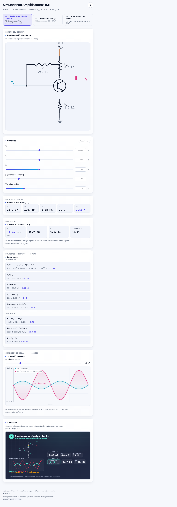
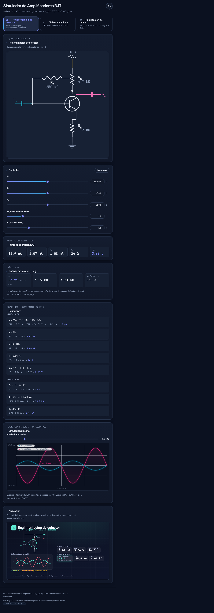
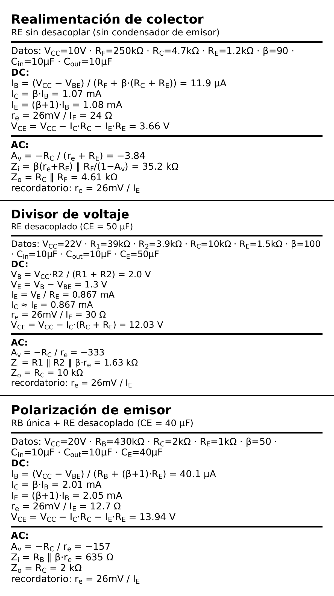
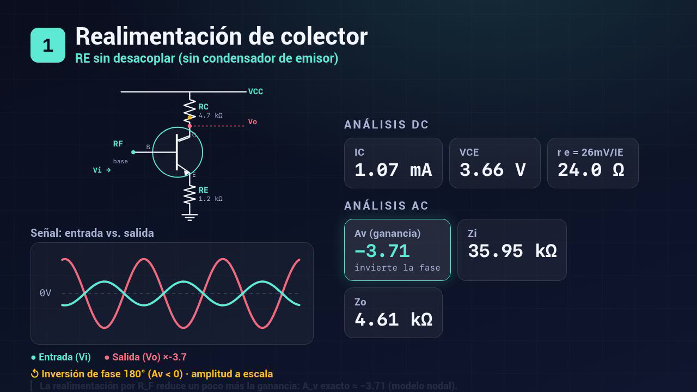

# Simulador de Amplificadores BJT

Laboratorio y simulador interactivo de **amplificadores con transistor bipolar (BJT)**. Resuelve el **análisis DC** (punto de operación, *punto Q*) y el **análisis AC** (señal pequeña con el **modelo r_e**) de tres configuraciones clásicas de polarización, las muestra en una **web app** con sliders en tiempo real y genera **etiquetas imprimibles Niimbot (50 × 30 mm)** con el resumen de cada circuito.

Pensado como material de estudio: cada número que ves aquí también está desarrollado paso a paso en [`docs/analisis.md`](docs/analisis.md), con las sustituciones numéricas explicadas.

- **Fuente teórica:** Boylestad — *Electronic Devices and Circuit Theory*.
- **Supuestos del modelo:** `VBE = 0.7 V`, `VT = 26 mV`, `ro = ∞`, método aproximado del divisor cuando `β·RE ≥ 10·R2`.

---

## Vista previa

**Web app interactiva** — diseño «Circuito Studio» (modo claro y oscuro, esquema en vivo, sliders, simulación de señal tipo osciloscopio y reproductor de animación bajo demanda):

| Claro | Oscuro |
|-------|--------|
|  |  |

**Etiquetas Niimbot (50 × 30 mm)** — las tres etiquetas apiladas:



---

## Los 3 circuitos

Todos los valores provienen de [`datos/circuitos.json`](datos/circuitos.json), que es la **única fuente de verdad** del proyecto. La web y las etiquetas se generan a partir de ese archivo.

### Circuito 1 — Realimentación de colector (*collector feedback*)

- **Configuración de polarización:** realimentación de colector (una resistencia `RF` entre colector y base).
- **RE:** **sin desacoplar** (no hay condensador de emisor; `RE` aparece también en AC).

**Valores dados:** `VCC = 10 V`, `RF = 250 kΩ`, `RC = 4.7 kΩ`, `RE = 1.2 kΩ`, `β = 90`, `C_in = 10 µF`, `C_out = 10 µF`.

| DC | Valor | | AC | Valor |
|----|------:|---|----|------:|
| I_B  | 11.908 µA   | | A_v | −3.71 *(simple −3.84)* |
| I_C  | 1.0717 mA   | | Z_i | 35 950 Ω *(simple 35 170 Ω)* |
| I_E  | 1.0836 mA   | | Z_o | 4 613 Ω |
| r_e  | 23.99 Ω     | |     | |
| V_CE | 3.663 V     | |     | |

> La realimentación por `RF` reduce un poco más la ganancia: `A_v` exacto ≈ −3.71 (modelo nodal) frente al ≈ −3.84 del cálculo a mano.

### Circuito 2 — Divisor de voltaje (*voltage divider*)

- **Configuración de polarización:** divisor de voltaje (`R1` y `R2` fijan la tensión de base).
- **RE:** **desacoplado** (`CE = 50 µF`; `RE` se cortocircuita en AC).

**Valores dados:** `VCC = 22 V`, `R1 = 39 kΩ`, `R2 = 3.9 kΩ`, `RC = 10 kΩ`, `RE = 1.5 kΩ`, `β = 100`, `C_in = 10 µF`, `C_out = 10 µF`, `C_E = 50 µF`.

| DC | Valor | | AC | Valor |
|----|------:|---|----|------:|
| V_B  | 2.0 V       | | A_v | −333.3 |
| V_E  | 1.3 V       | | Z_i | 1 625 Ω |
| I_B  | 8.667 µA    | | Z_o | 10 000 Ω |
| I_C  | 0.8667 mA   | |     | |
| I_E  | 0.8667 mA   | |     | |
| r_e  | 30.0 Ω      | |     | |
| V_CE | 12.033 V    | |     | |

> `β·RE = 150 kΩ ≥ 10·R2 = 39 kΩ` → es válido el **método aproximado del divisor**.

### Circuito 3 — Polarización de emisor (*emitter bias*)

- **Configuración de polarización:** polarización de emisor con **una sola resistencia de base** `RB`.
- **RE:** **desacoplado** (`CE = 40 µF`; estabiliza el punto Q en DC pero en AC está cortocircuitado).

**Valores dados:** `VCC = 20 V`, `RB = 430 kΩ`, `RC = 2 kΩ`, `RE = 1 kΩ`, `β = 50`, `C_in = 10 µF`, `C_out = 10 µF`, `C_E = 40 µF`.

| DC | Valor | | AC | Valor |
|----|------:|---|----|------:|
| I_B  | 40.125 µA   | | A_v | −157.4 |
| I_C  | 2.0062 mA   | | Z_i | 634.3 Ω |
| I_E  | 2.0464 mA   | | Z_o | 2 000 Ω |
| r_e  | 12.71 Ω     | |     | |
| V_CE | 13.941 V    | |     | |

> La polarización es por una sola `RB`; `RE` estabiliza el punto Q en DC, pero en AC está desacoplado.

---

## Supuestos del modelo

El motor de cálculo trabaja con el **modelo r_e** de señal pequeña y estas hipótesis:

- **`VBE = 0.7 V`** — caída fija de la unión base-emisor en conducción.
- **`VT = 26 mV`** — tensión térmica a temperatura ambiente; de ahí `r_e = VT / I_E`.
- **`ro = ∞`** — se desprecia la resistencia de salida del transistor (efecto Early), de modo que `Z_o ≈ RC`.
- **Método aproximado del divisor:** cuando `β·RE ≥ 10·R2` se asume que la corriente de base es despreciable frente a la del divisor y se calcula `V_B = VCC·R2 / (R1 + R2)` directamente. Si no se cumple, el motor recurre al equivalente de **Thévenin** exacto.

---

## Cómo usar la web app

Hay **dos versiones** de la misma aplicación (idéntica funcionalidad y mismo motor de cálculo):

### App React (Vite + TypeScript) — versión principal · `app/`

```bash
cd app
npm install
npm run dev       # servidor de desarrollo (http://localhost:5173)
npm run build     # compila a app/dist (estático, listo para desplegar)
npm run preview   # sirve la compilación de producción
```

### Versión sin compilación (vanilla, *fallback*) — `web/`

HTML + JavaScript puro, sin dependencias ni *build*: abre `web/index.html` directamente o sírvelo con `cd web && python3 -m http.server`.

### Despliegue en Vercel (recomendado)

Como Vite genera un sitio estático, Vercel lo sirve sin configuración de servidor. Dos formas:

**A. Importar desde el dashboard** — la más simple:
1. [vercel.com/new](https://vercel.com/new) → *Import* el repo `simulador-amplificadores-bjt`.
2. En **Root Directory** elige `app` → Vercel detecta **Vite** (build `npm run build`, salida `dist`).
3. *Deploy*. Cada *push* despliega automáticamente.

**B. Con el [`vercel.json`](vercel.json) incluido** (deja Root Directory en la raíz) o con la CLI:
```bash
npm i -g vercel
vercel          # despliegue de previsualización
vercel --prod   # despliegue a producción
```
El `vercel.json` ya define `installCommand`/`buildCommand`/`outputDirectory` apuntando a `app/`, así que el deploy desde la raíz funciona tal cual.

### Despliegue en GitHub Pages (alternativa)

El workflow [`.github/workflows/deploy.yml`](.github/workflows/deploy.yml) compila `app/` y la publica en GitHub Pages en cada *push* a `main`:

**https://davixcky.github.io/simulador-amplificadores-bjt/**

(Vite usa `base: './'` → rutas relativas, válido tanto en Pages como en Vercel o en cualquier subcarpeta.)

### Dentro de la app

- **Modo claro/oscuro:** botón de tema (persistido en `localStorage`, inicial según el sistema). Enlazable con `?tema=claro|oscuro` y `?circuito=c1|c2|c3`.
- **Sliders:** cambia los valores ajustables (`RF`, `RC`, `RE`, `β`, `VCC`, `R1`, `R2`, `RB`…); las tarjetas DC/AC, las ecuaciones y la **simulación de señal** (inversión de fase + recorte) se recalculan **en tiempo real** con el mismo motor (`engine.ts` / `engine.js`) que valida la auto-prueba.

---

## Vídeo explicativo (Remotion)

Vídeo animado y didáctico (1280×720, ~22 s) renderizado con [Remotion](https://www.remotion.dev/): intro, una escena por circuito con su esquema y métricas DC/AC, y la animación de señal con la inversión de fase. Archivo: [`video/out/bjt-amplificadores.mp4`](video/out/bjt-amplificadores.mp4).



```bash
cd video
npm install
npm start          # Remotion Studio (previsualización interactiva)
npm run render     # renderiza video/out/bjt-amplificadores.mp4
```

---

## Cómo regenerar el PDF de etiquetas (Node, sin Python)

Las etiquetas Niimbot (50 × 30 mm) resumen cada circuito en formato imprimible. El generador usa **Node + [pdfkit](https://pdfkit.org/)** y la fuente DejaVu Sans embebida en [`etiquetas/fonts/`](etiquetas/fonts/) (sin dependencias de Python).

```bash
npm install            # una vez: instala pdfkit (raíz del repo)
npm run etiquetas      # genera etiquetas/etiquetas-bjt.pdf (3 páginas) + etiquetas-hoja.pdf (las 3 apiladas)
```

Para previsualizar el PDF como imagen se usa `pdftoppm` (de **poppler**, no Python):

```bash
pdftoppm -png -r 600 etiquetas/etiquetas-bjt.pdf   etiquetas/preview        # preview-1/2/3.png
pdftoppm -png -r 600 etiquetas/etiquetas-hoja.pdf  etiquetas/preview-todas  # hoja de contacto
```

---

## Estructura del repositorio

```
simulador-amplificadores-bjt/
├── app/          # App React (Vite + TypeScript) — versión principal
├── web/          # Web app vanilla (sin build) — fallback
├── video/        # Proyecto Remotion + mp4 renderizado (out/)
├── etiquetas/    # Generador de etiquetas Niimbot 50×30 mm (Node/pdfkit + fonts/)
├── datos/        # circuitos.json — fuente única de verdad de los números
├── docs/         # Apuntes de estudio + capturas
├── scripts/      # Auto-prueba del motor (engine.test.js) y gen_data.mjs
├── package.json  # Herramientas Node (etiquetas, datos, test) — sin Python
├── vercel.json   # Configuración de despliegue en Vercel
└── .github/      # Workflow de despliegue en GitHub Pages
```

> **Sin Python:** todo el *tooling* es Node (`npm run etiquetas`, `npm run datos`, `npm test`). El antiguo generador en Python se reemplazó por `etiquetas/generar_etiquetas.mjs` (pdfkit).

---

## Cómo correr la auto-prueba del motor

La prueba compara la salida de `BJT.solve()` contra los valores canónicos de `datos/circuitos.json` (tolerancia ~1–2 %):

```bash
node scripts/engine.test.js
```

Salida esperada: una línea por magnitud verificada de cada circuito y, al final, `✅ Todas las pruebas pasaron.`

Para regenerar `web/circuitos.data.js` tras editar el JSON:

```bash
npm run datos      # node scripts/gen_data.mjs
```

---

## Fórmulas (resumen por topología)

Notación: `∥` = paralelo de resistencias, `/` = división, `·` = producto.

### Comunes (modelo r_e)

- `r_e = VT / I_E = 26mV / I_E`
- `I_C = β·I_B`
- `I_E = (β+1)·I_B`

### Divisor de voltaje — RE desacoplado

- DC: `V_B = VCC·R2 / (R1+R2)` / `V_E = V_B − VBE` / `I_E = V_E / RE` / `I_C ≈ I_E` / `V_CE = VCC − I_C·(RC+RE)`
- AC: `A_v = −RC / r_e` / `Z_i = R1 ∥ R2 ∥ β·r_e` / `Z_o = RC`

### Polarización de emisor (RB única) — RE desacoplado

- DC: `I_B = (VCC − VBE) / (RB + (β+1)·RE)` / `I_C = β·I_B` / `I_E = (β+1)·I_B` / `V_CE = VCC − I_C·RC − I_E·RE`
- AC: `A_v = −RC / r_e` / `Z_i = RB ∥ β·r_e` / `Z_o = RC`

### Realimentación de colector — RE sin desacoplar

- DC: `I_B = (VCC − VBE) / (RF + β·(RC+RE))` / `I_C = β·I_B` / `I_E = (β+1)·I_B` / `V_CE = VCC − I_C·RC − I_E·RE`
- AC (a mano): `A_v = −RC / (r_e + RE)` / `Z_i = β(r_e+RE) ∥ RF/(1−A_v)` / `Z_o = RC ∥ RF`
- AC (exacto, nodal): `A_v = (1/RF − β/Zb) / (1/RF + 1/RC)`, con `Zb = β·r_e + (β+1)·RE`
